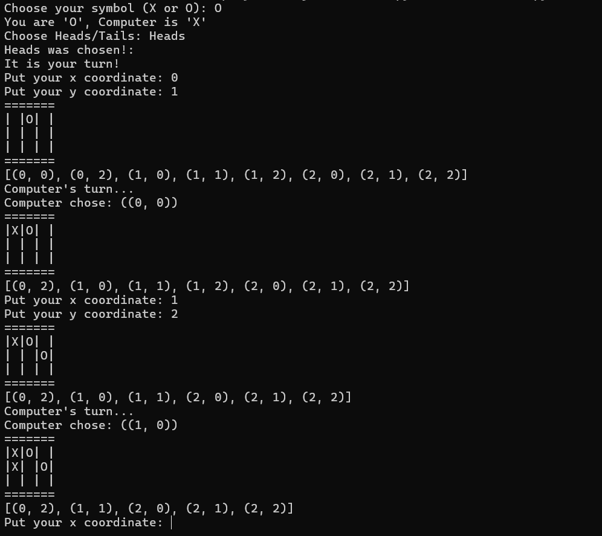
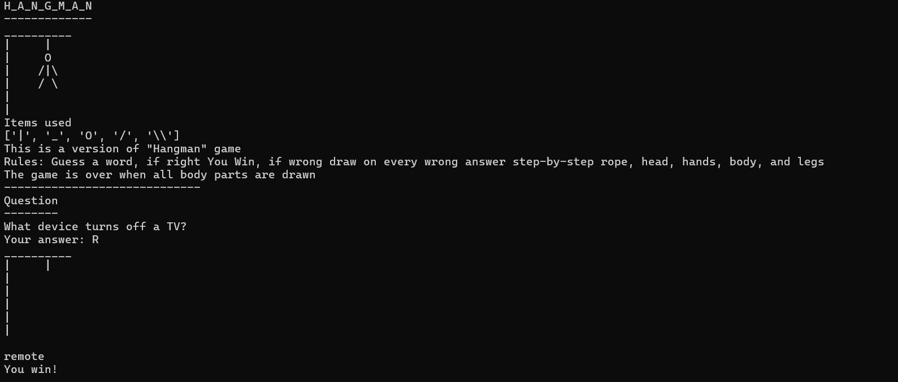
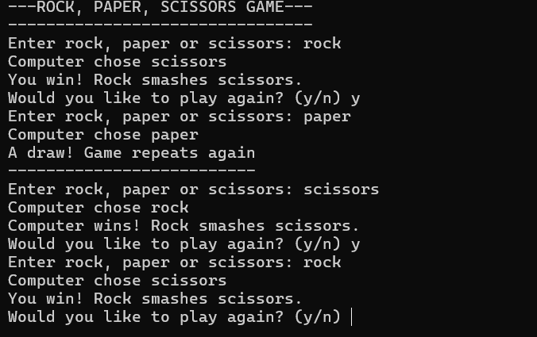

# 🐍 Python

This repo contains Python programs and projects created by [VortAmplifier](https://github.com/VortAmplifier/Python). These range from beginner exercises to small games and GUI apps.

This repository showcases my Python skills through a collection of projects and exercises that cover core programming principles and practical problem-solving.

> **Note**: Most programs require **Python 3.7** or higher.

---

## 🚀 How to Use This Repo

### 1. Clone the repository

```bash
git clone https://github.com/VortAmplifier/Python.git
cd Python/tic_tac_toe/
python file_name.py
```

### 🌟 Highlight Projects

- **tic_tac_toe.py**  
  A beginner-friendly project using loops, conditionals, and logic.  
  [⬇️ Download](https://raw.githubusercontent.com/VortAmplifier/Python/main/tic_tac_toe.py)
  
  
- **Inventory.py**  
  Demonstrates linked list structure and simple item management.  
  [⬇️ Download](https://raw.githubusercontent.com/VortAmplifier/Python/main/Inventory.py)
  

- **hangman_game_work_in_progress.py**  
  Text-based word guessing game. Could grow into something bigger.  
  [⬇️ Download](https://raw.githubusercontent.com/VortAmplifier/Python/main/hangman_game_work_in_progress.py)
  
  
- **rock_paper_scissors_game.py**  
  Classic game with Python input/output and conditionals.  
  [⬇️ Download](https://raw.githubusercontent.com/VortAmplifier/Python/main/rock_paper_scissors_game.py)
  
